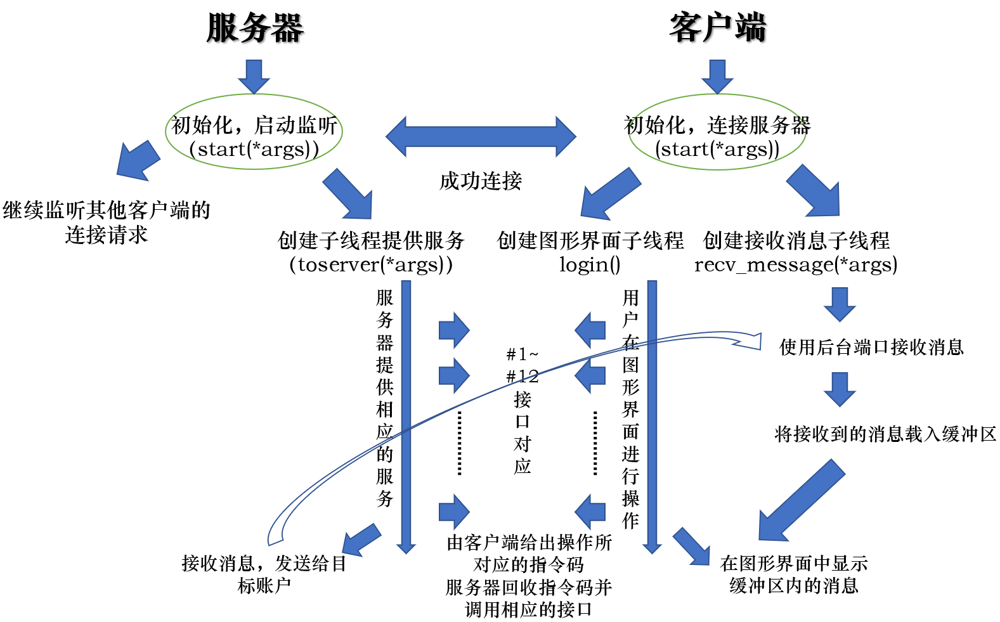
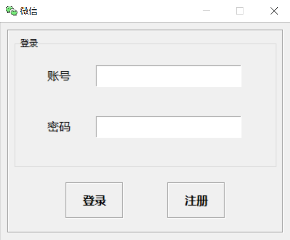
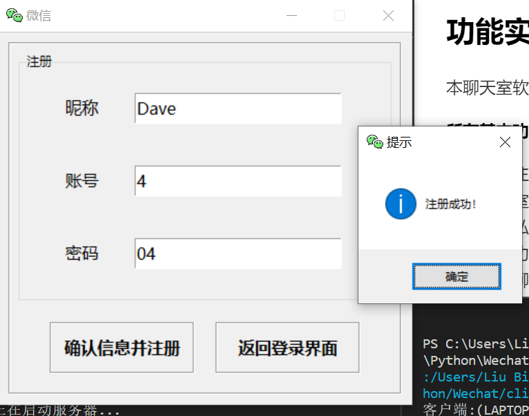
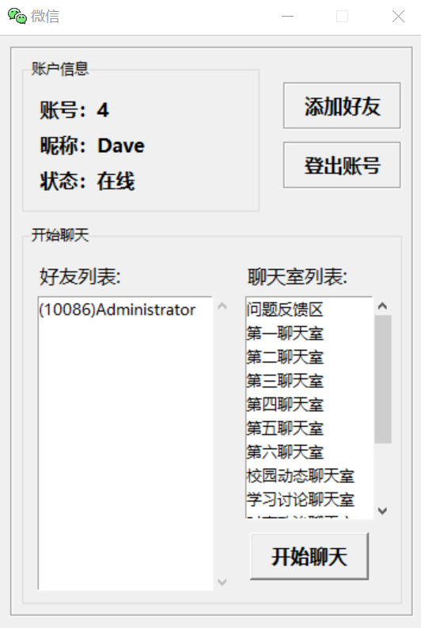
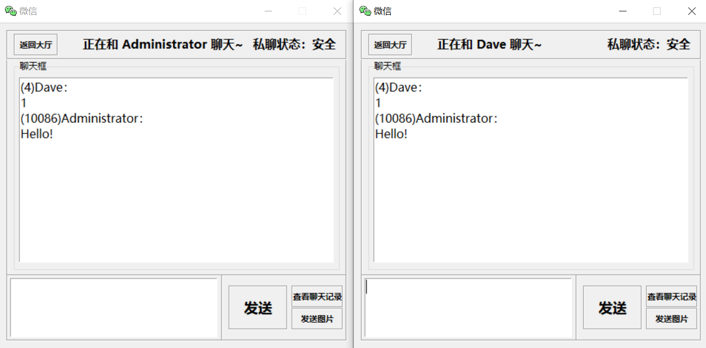
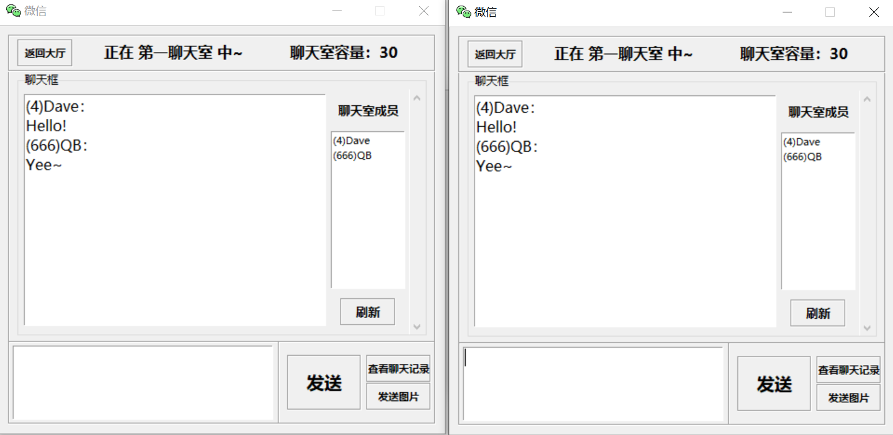
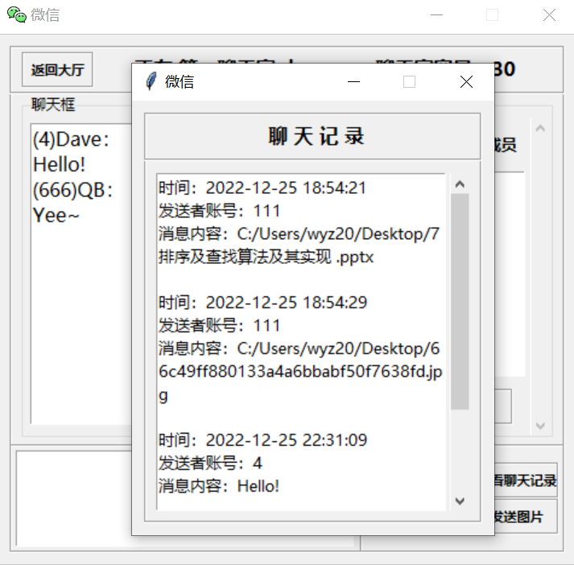

# Pychat 聊天室

清华大学「Python 程序设计」课程大作业 —— 基于 socket 的多人聊天室软件。

授课教师：谌卫军

## 功能

- 账号注册与登录（支持重复登录检测）
- 好友管理：添加好友、查看好友列表
- 好友私聊：实时一对一消息收发
- 聊天室：13 个预设聊天室，支持多人同时在线聊天
- 聊天记录：私聊和聊天室的历史消息均可查看
- 数据持久化：用户信息、好友关系、聊天记录存储在 SQLite 数据库中

## 技术栈

| 类别 | 技术 |
|------|------|
| 网络通信 | `socket`（TCP） |
| 图形界面 | `tkinter` / `ttk` |
| 数据库 | `sqlite3` |
| 并发 | `threading` |

## 项目结构

```
Pychat/
├── server/
│   ├── main.py          # 服务端启动入口
│   ├── server.py        # 服务端核心逻辑（12 个接口）
│   ├── database.py      # 数据库操作（9 个接口）
│   └── data/
│       ├── Info.db      # 账户、好友、聊天室信息
│       └── History.db   # 聊天记录
├── client/
│   ├── main.py          # 客户端启动入口
│   ├── client.py        # 客户端核心逻辑（12 个接口）
│   ├── GUI_framework.py # 图形界面（8 个窗口）
│   └── pics/
│       └── icon.ico
└── docs/
    ├── report.md        # 实验报告
    ├── report.pdf
    └── pics/            # 截图
```

## 架构概览

采用 **客户端-服务器** 架构，每个客户端与服务器建立两条 TCP 连接：

- **主连接**：发送请求、接收响应
- **后台连接**：异步接收其他用户发来的消息

客户端与服务器之间通过自定义的**指令码协议**通信（如 `__login__`、`__chat__`、`__broadcast__` 等），服务端为每个客户端分配独立线程处理请求。



## 运行方式

### 启动服务端

```bash
cd server
python main.py
```

服务端默认监听 `localhost:49152`。

### 启动客户端

```bash
cd client
python main.py
```

可同时启动多个客户端实例。

### 预置账号

管理员账号：`10086`，密码：`admin`

也可以自行注册新账号（纯数字，不超过 4 位）。

## 截图

<details>
<summary>点击展开截图</summary>

**登录界面**



**账号注册**



**聊天目录**



**好友私聊**



**聊天室聊天**



**查看聊天记录**



</details>
